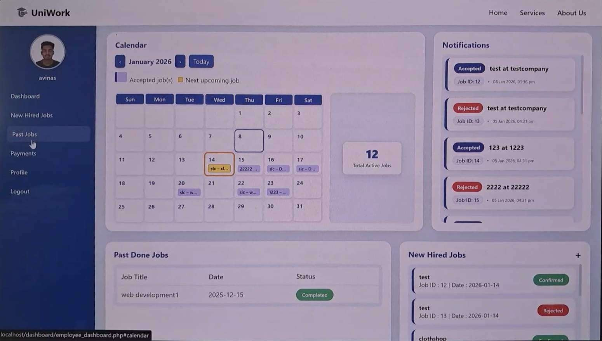
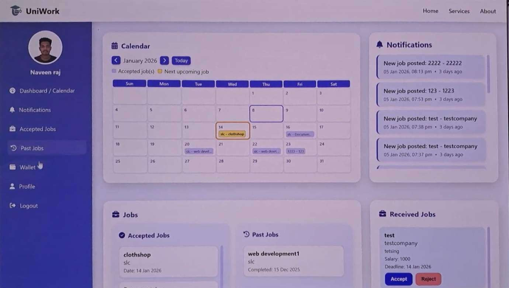

# 🎓 UniWork – University Job Matching Platform

A web-based job matching platform designed for university students and employers.  
This system provides dedicated dashboards for both user roles, enabling efficient job posting, tracking, and application management.

---

## 👨‍💻 My Contribution
- Designed and developed:
  - ✅ Employee Dashboard
  - ✅ Student Dashboard
- Implemented backend logic using PHP & MySQL
- Built dynamic UI with job tracking, notifications, and calendar system
- Integrated database-driven features for real-time updates

---

## 🚀 Features

### 🧑‍💼 Employee Dashboard
- Post and manage job listings
- View job applications from students
- Track upcoming deadlines using calendar
- Receive notifications for applications
- Profile management

---

### 🎓 Student Dashboard
- Browse and apply for jobs
- Track applied job status
- View upcoming deadlines
- Notifications for job updates
- Personal profile management

---

## 📊 Key Functionalities
- 🔔 Notification system
- 📅 Interactive calendar for job deadlines
- 📌 Job tracking (Pending / Confirmed / Completed)
- 👤 User profile management
- 📂 File upload system (profile images)

---

## 🛠 Technologies Used
- **Frontend:** HTML, CSS, JavaScript  
- **Backend:** PHP  
- **Database:** MySQL  

---

## 🎥 Demo Videos

### 🔹 Employee Dashboard Demo
👉 https://drive.google.com/file/d/1qVzuZGH2m1yhOSPz58I_XHnfuaU2TCt7/view?usp=drive_link

### 🔹 Student Dashboard Demo
👉 https://drive.google.com/file/d/1g97a9FlO9JGNHbKbm5Wf9iOkzkiOQi5n/view?usp=drive_link

---

## 📸 Screenshots

### Employee Dashboard

### Student Dashboard

---
